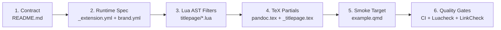

# Developer Field Notes & Architectural Decisions

Internal working notes, architectural decisions, and technical onboarding reference for the `quarto_temple_brand` extension repository.

* For end-user installation, usage guides, and format options, see [README.md](file:///c:/Users/jkyle/Documents/GitHub/quarto_temple_brand/README.md).
* For version release notes and changelog history, see [NEWS.md](file:///c:/Users/jkyle/Documents/GitHub/quarto_temple_brand/NEWS.md).
* For contribution policies and PR guidelines, see [CONTRIBUTING.md](file:///c:/Users/jkyle/Documents/GitHub/quarto_temple_brand/CONTRIBUTING.md).

---

## 1. Project Overview & Scope Boundaries

### Origin & Intent
This repository packages Temple University's brand identity—configured specifically for the **Center for Biostatistics & Epidemiology (CBE)** at the Lewis Katz School of Medicine—as a reusable Quarto extension. It distributes a unified brand configuration (`brand.yml`), institutional branding assets (such as the Temple "T" logo), and custom document formats (`temple-html`, `temple-pdf`, `temple-typst`, `temple-revealjs`) across the ecosystem.

### Scope Separation: The "Quarto vs. R" Boundary
* **Rule of thumb:**
  * **Quarto compile-time assets belong in `quarto_temple_brand`:** If Quarto or Pandoc reads it during document compilation (`brand.yml`, logo files, format YAML defaults, titlepage layouts, Lua filters, and TeX partials/macros), it lives in **this** repository.
  * **R runtime functions belong in `TempleCBE`:** If R reads or executes it (`ggplot2` scales, `theme_temple()`, report scaffolding, `render_me()`, `zip_render()`), it lives in the **`TempleCBE`** package repository.
* **Brand Synchronization:**
  `TempleCBE` mirrors `brand.yml` in its `inst/brand/brand.yml` directory and runs unit tests verifying palette parity (`tests/testthat/test-temple_brand.R`). If colors or fonts are modified here, open a companion PR in `TempleCBE` to keep both synchronized.

### Trademark vs. Code License
* **Code & Configuration:** Dual-licensed under **MIT** and **GPL-3** via [LICENSE-MIT](file:///c:/Users/jkyle/Documents/GitHub/quarto_temple_brand/LICENSE-MIT) and [LICENSE-GPL-3](file:///c:/Users/jkyle/Documents/GitHub/quarto_temple_brand/LICENSE-GPL-3).
* **Temple Trademark Marks:** The Temple "T" logo (`Temple_T_logo.png`) and institutional identity assets are **not** covered by the open-source licenses. They remain protected Temple University marks. External or non-Temple redistribution requires University MarCom approval (`kevin.haugh@temple.edu` / `claweb@temple.edu`).

### Sibling Extension Layout
* Users install the extension via:
  ```bash
  quarto add jkylearmstrong-temple/quarto_temple_brand
  ```
* This installs two extensions side-by-side:
  ```
  _extensions/<org>/temple/
  _extensions/<org>/titlepage/
  ```
* Because an extension format cannot inherit another extension's format, `temple-pdf` references the title page filters and partials via relative paths (`../titlepage/...`). **`temple` and `titlepage` must remain sibling directories** under `_extensions/`.

---

## 2. Architecture & Runtime Pipeline

Follow this 6-stage sequence from conceptual design to compilation:



### Core Runtime Contract (`_extension.yml` + `brand.yml`)
* **Format Defaults Schema Gotcha:** Format defaults **must** live in `_extensions/temple/_extension.yml` under `contributes.formats.<fmt>`, **not** inside `brand.yml`. Quarto's brand schema only parses `defaults.bootstrap` and `defaults.quarto` from a brand file; format blocks placed in `brand.yml` are silently ignored.
* **Color System Structure:**
  * *Primary:* Cherry (`#a41e35`), White (`#ffffff`), Black (`#000000`).
  * *Secondary:* Book Nook (`#fff2e8`, warm background for code blocks), Clear Skies (`#deefec`).
  * *Accents (Formal):* Night Owl (`#005a70`), Academic Gold (`#ad7422`), Founders Garden (`#772762`), Diamond Acres (`#9e9597`).
  * *Accents (Casual):* Conwell Blue (`#12d0ff`), Upward Momentum (`#1fceb6`), Owls Eye (`#f3aa00`), Cherry Blossom (`#fe649f`).
  * *Hyperlink Color:* Explicitly set to conventional blue (`#0563c1`), not red/cherry, preventing links from reading as error states in print.
* **Typography:**
  * Body: `Faustina` (Google Font).
  * Headings: `Roboto` Bold (Google Font).
  * Monospace: `JetBrains Mono` (Google Font).
  * *Typst Unit Warning:* Typst interprets font sizes in `pt`/`em`. When specifying `rem` in `brand.yml`, Quarto's Typst engine issues a benign fallback notice (`(W) brand.typography.base.size in rem units, changing to em`).

### Metadata Normalization Layer (Lua Filters)
* The Lua filters (`titlepage-theme.lua`, `coverpage-theme.lua`) run during Pandoc AST transformation before template substitution.
* They parse document YAML keys, validate enum options, assign defaults, calculate LaTeX dimensions, and inject normalized variables into Pandoc template metadata.
* **Testing Lua Without Standalone Lua Installed:**
  Execute filters using Quarto's embedded Pandoc engine:
  ```bash
  quarto pandoc lua -e "print(_VERSION)"
  quarto pandoc lua -e "dofile('_extensions/titlepage/titlepage-theme.lua')"
  ```
  Or run the included test scripts: `powershell -File tests/run-lua-tests.ps1` / `bash tests/run-lua-tests.sh`.

### Rendering Layer (LaTeX Partials & Temple-PDF Recipe)
* `temple-pdf` uses the `bg-image` theme partials:
  * Upper-left cherry corner graphic (`temple-corner.png`).
  * Left cherry vertical rule (`vrule-width: 2pt`, `vrule-color: templecherry`).
  * Title in bold cherry, subtitle in black italic.
  * Numbered affiliations with correspondence block (emails, ORCIDs).
  * Footer: CBE mailing address (left 72% width) aligned with Temple "T" logo (right 24% width).
* **Color Definitions in Partials:**
  Colors (`templecherry`, `templeNightOwl`, `templeBlack`, `templeBookNook`, `templelinkblue`) and macros (`\templefooterlogo`) are declared in `_extensions/titlepage/pandoc.tex` using `\providecolor` and `\providecommand` right after the user's `header-includes`. This ensures user-defined `include-in-header` blocks do not overwrite institutional colors.

---

## 3. Recommended Format Snippets & Configurations

Reference configurations for multi-format publishing projects:

### HTML: Expandable Left TOC & Dynamic Themes
```yaml
html:
  smooth-scroll: true
  theme:
    light: flatly
    dark: darkly
  toc: true
  toc-location: left
  toc-expand: true
  lot: true             # List of Tables
  lof: true             # List of Figures
  number-depth: 6
  number-sections: true
  section-divs: true
```

### Typst: Fast Native Engine
```yaml
typst:
  toc: true
  number-sections: true
  fontsize: 11pt
  margin:
    x: 1in
    y: 1in
```

### LaTeX / PDF Inclusions
```yaml
format:
  pdf:
    include-in-header:
      text: |
        \usepackage[noblocks]{authblk}
        \usepackage{lscape}
        \newcommand{\blandscape}{\begin{landscape}}
        \newcommand{\elandscape}{\end{landscape}}
    template-partials:
      - title.tex
```

---

## 4. Local Verification & Developer Gotchas

### Local Smoke Testing
Always render `example.qmd` to test changes end-to-end:
```bash
quarto render example.qmd
```

### Multi-Format PDF Overwrite Gotcha
* `example.qmd` exercises `temple-html`, `temple-typst`, and `temple-pdf`.
* **Important:** Both `temple-typst` and `temple-pdf` produce files with the `.pdf` extension. During a full `quarto render example.qmd`, Typst compiles last and **overwrites** `example.pdf`.
* To inspect formats individually:
  ```bash
  quarto render example.qmd --to temple-pdf      # Compiles LaTeX titlepage
  quarto render example.qmd --to temple-typst    # Compiles Typst PDF
  quarto render example.qmd --to temple-html     # Compiles HTML output
  quarto render example.qmd --to temple-revealjs # Compiles Reveal.js presentation
  ```

### Visual Output Inspection Checklist
* **HTML:** Sticky TOC on left margin, Book Nook code block backgrounds, blue underlined links.
* **PDF:** Cherry corner graphic at top left, cherry vertical rule, address + "T" logo footer.

---

## 5. Quality Gates & Release Checklist

### CI Workflows (`.github/workflows/`)
1. **`ci.yml`:** Installs Quarto, TeX Live packages (`fonts-lmodern`, `cm-super`, `texlive-fonts-recommended`, `texlive-fonts-extra`), and renders `example.qmd`.
2. **`lua-lint.yml`:** Enforces clean `luacheck` against `.luacheckrc` and executes Lua test scripts.
3. **`link-check.yml`:** Scans all URLs across markdown documents and YAML specs for broken links.

### Pre-PR Checklist
1. Run Lua smoke tests:
   ```powershell
   powershell -File tests/run-lua-tests.ps1
   ```
2. Run luacheck (if installed locally):
   ```bash
   luacheck _extensions/titlepage/*.lua
   ```
3. Test compilation across formats:
   ```bash
   quarto render example.qmd --to temple-html
   quarto render example.qmd --to temple-pdf
   quarto render example.qmd --to temple-typst
   ```
4. Verify Git LFS tracking:
   Fonts and binary assets in `_extensions/titlepage/` are tracked via Git LFS in `.gitattributes`. Ensure `git-lfs` is active so pointer files are not committed as plain text.

---

## 6. Current Status & Roadmap

* **Version 1.1.0:**
  * Multi-format definitions placed in `_extension.yml`.
  * Obsolete/drifted root `_brand.yml` removed.
  * Title page `logo-size` dimension fixed (`0.12\textwidth`).
  * Palette re-aligned with updated College of Liberal Arts guidelines.
  * Side-by-side extension layout finalized.
* **Future Work:**
  * Add automated visual regression tests for PDF title pages.
  * Expand Typst template components as Quarto Typst support matures.
