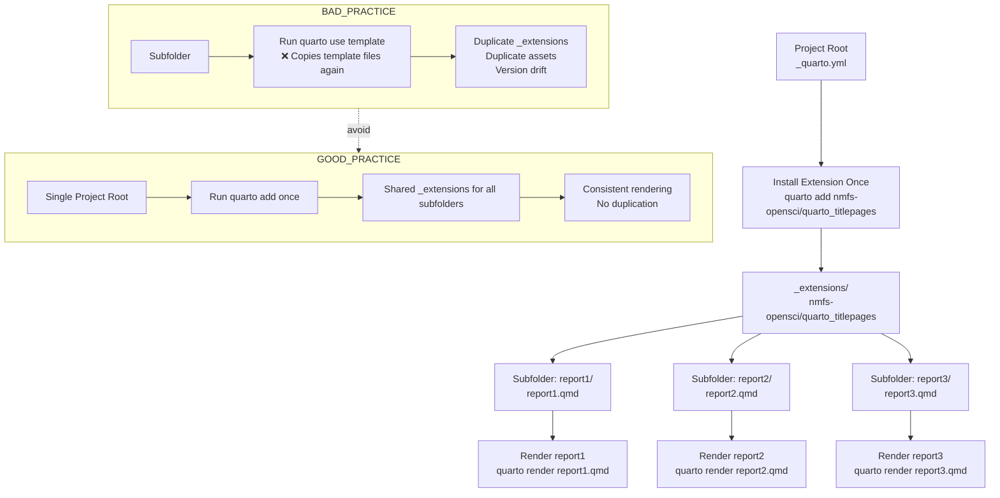

# Temple University Quarto Brand Extension

This repository packages the Temple University brand identity—specifically configured for the **Center for Biostatistics & Epidemiology (CBE)** at the Lewis Katz School of Medicine—as a reusable Quarto extension.

It distributes a unified brand configuration (`brand.yml`), branding assets (such as the Temple "T" logo), and Temple document formats that can be pulled into and reused across other Quarto websites, dashboards, presentations, and documents.

## Features

- **Color Palette:** Temple's current palette as published at [liberalarts.temple.edu/marcom/logos-and-brand](https://liberalarts.temple.edu/marcom/logos-and-brand):
  - Primary: Temple Cherry `#a41e35`, White `#ffffff`, Black `#000000`
  - Secondary: Clear Skies `#deefec`, Book Nook `#fff2e8`
  - Formal accents: Academic Gold `#ad7422`, Diamond Acres `#9e9597`, Founder's Garden `#772762`, Night Owl `#005a70`
  - Casual accents: Owl's Eye `#f3aa00`, Conwell Blue `#12d0ff`, Upward Momentum `#1fceb6`, Cherry Blossom `#fe649f`

  Semantic roles: `primary` cherry, `secondary` Night Owl, `tertiary` Academic Gold, `success` Upward Momentum, `info` Conwell Blue, `warning` Owl's Eye, `danger` Cherry Blossom, `light` Book Nook, `foreground`/`dark` black, `background` white.
- **Typography:** The Google Fonts used on the CLA brand site:
  - Base text: **Faustina**
  - Headings: **Roboto** (bold)
  - Monospace/Code block fonts: **JetBrains Mono** (the brand names none)
  - Code backgrounds: Book Nook (`#fff2e8`)
- **Logo Assets:** Packages the primary Temple "T" logo.
- **Formats:** Contributes Temple document formats:
  - **`temple-html`:** Table of contents, code tools, paged data frames, centered figures.
  - **`temple-pdf` (LaTeX):** Temple title page—cherry corner with the Temple "T" at upper left, cherry vertical rule, date under the subtitle, authors with numbered affiliations, a correspondence list of emails and ORCIDs, and the CBE mailing address beside the Temple "T" at the bottom—built on the bundled [`nmfs-opensci/quarto_titlepages`](https://github.com/nmfs-opensci/quarto_titlepages) extension, with numbered sections, a table of contents, and blue links.
  - **`temple-typst`:** PDF without a LaTeX installation; table of contents, numbered sections, 1in margins.
  - **`temple-revealjs`:** Fade transitions, slide numbers, CBE footer.

Every format, including plain `html`, `typst`, and `revealjs`, also picks up the brand colors, fonts, and logo.

---

## Installation

From the root of your Quarto project (a directory with a `_quarto.yml`; `project: {type: default}` is enough):

```bash
quarto add jkylearmstrong-temple/quarto_temple_brand
```

This installs two extensions side by side under `_extensions/jkylearmstrong-temple/`: `temple` (brand and formats) and `titlepage` (used by `temple-pdf`). Keep them together—`temple-pdf` finds the title page files by relative path.

To pin a version, add a tag: `quarto add jkylearmstrong-temple/quarto_temple_brand@v1.1.0`.

From R, [TempleCBE](https://github.com/jkylearmstrong/TempleCBE) does the same and creates `_quarto.yml` if it is missing:

```r
TempleCBE::use_temple_brand("analysis")
TempleCBE::create_report("analysis", template_name = "temple")
```

### Using `quarto_titlepages` Across Subfolders (No Duplication)

If your project has multiple report subfolders, run `quarto add nmfs-opensci/quarto_titlepages` **once** from the project root (the folder containing `_quarto.yml`). This creates one shared `_extensions/nmfs-opensci/quarto_titlepages` directory that every subfolder can use.



Avoid running `quarto use template` separately inside each report subfolder, which can duplicate assets and create version drift.

---

## Usage

The brand applies to every document in the project as soon as the extension is installed; no `brand:` key is needed. Choose Temple formats in a document's YAML:

```yaml
---
title: "Report Title"
subtitle: "Center for Biostatistics & Epidemiology"
author:
  - name: Author Name
    affiliations:
      - name: Lewis Katz School of Medicine at Temple University
format:
  temple-html: default
  temple-pdf: default
  temple-typst: default
---
```

The `temple-pdf` title page shows the cherry corner graphic by default. Set `titlepage-corner: false` in a document's YAML to drop it; the title moves up to a 1in top margin.

To match figures to the brand in R, use TempleCBE's `theme_temple()`, `scale_colour_temple()`, and `scale_fill_temple()`.

Format settings live in `_extensions/temple/_extension.yml`, not `brand.yml`: Quarto reads only `defaults.bootstrap` and `defaults.quarto` from a brand file, so per-format keys there are ignored.

---

## Development & Local Testing

If you are developing or modifying the brand extension itself in this repository:

1. Make your changes directly inside `_extensions/temple/brand.yml` or `_extensions/temple/_extension.yml`.
2. Render the local test page to preview your changes:
   ```bash
   quarto render example.qmd
   ```
   This renders every format in `example.qmd`; `temple-pdf` needs LaTeX (e.g. TinyTeX).
3. Check the compiled `example.html` and `example.pdf`.
4. If you change the color palette, update TempleCBE's copy (`inst/brand/brand.yml` and `temple_colors()`) to match.

---

## Brand Review Workflow

For Temple MarCom or other institutional brand reviewers:

- Open a focused issue or PR for each logo, asset, palette, typography, or policy change that needs approval.
- Prefer inviting a Temple-owned GitHub username or team alias for in-repo review rather than posting personal contact details in a public thread.
- If GitHub access is not available, collect invite/contact details in a private channel and summarize the resulting approval decision back in the issue or PR without publishing personal email addresses.
- Treat repository review access as read-only unless a broader collaborator role is explicitly requested and approved.

This keeps review feedback attached to the exact change being proposed while avoiding publication of individual email addresses in this public repository.

---

## License

Dual-licensed at your option under either:

- the MIT License ([LICENSE-MIT](LICENSE-MIT)), or
- the GNU General Public License v3.0 ([LICENSE-GPL-3](LICENSE-GPL-3))

This covers the extension code and configuration (`brand.yml`, `_extension.yml`, format defaults, etc.). It does **not** grant rights to the Temple University name, "T" logo, or other institutional brand marks bundled here as assets — those remain Temple's trademarks regardless of the code license, and reuse outside Temple-affiliated projects should go through Temple's own brand/trademark guidelines, not this repo's license.
